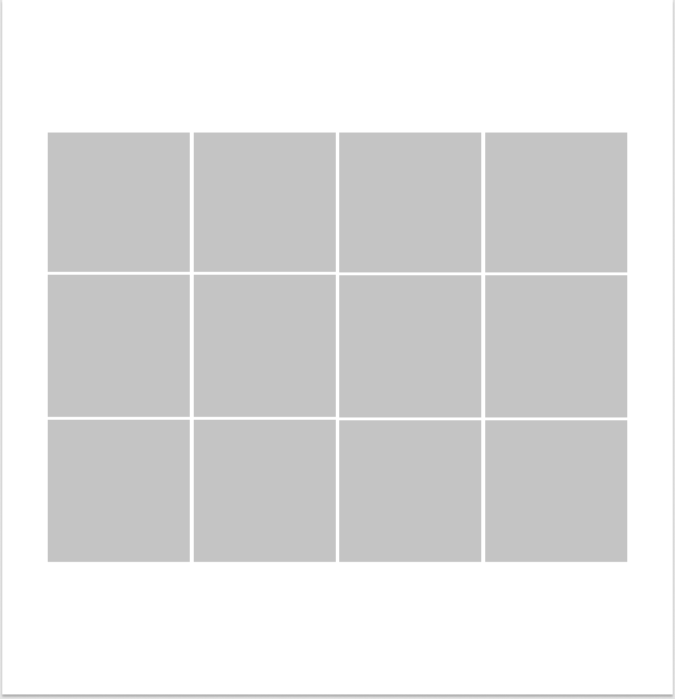
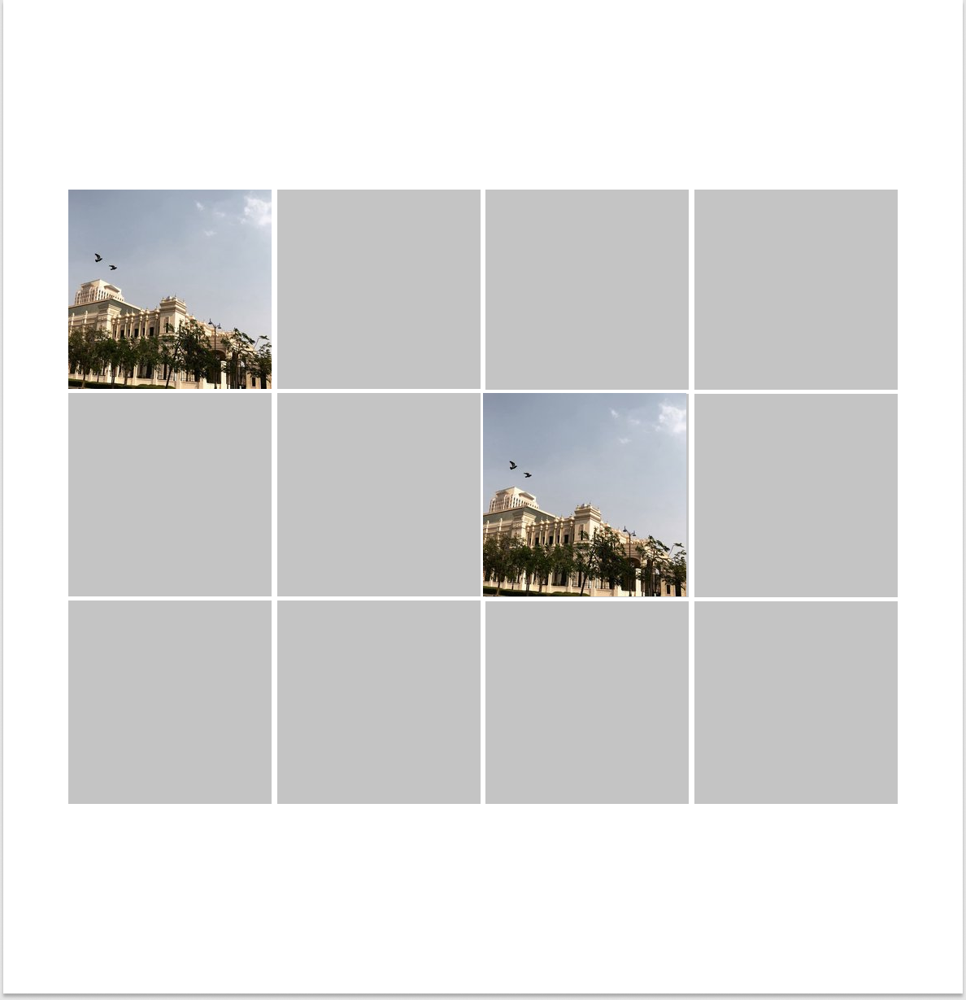
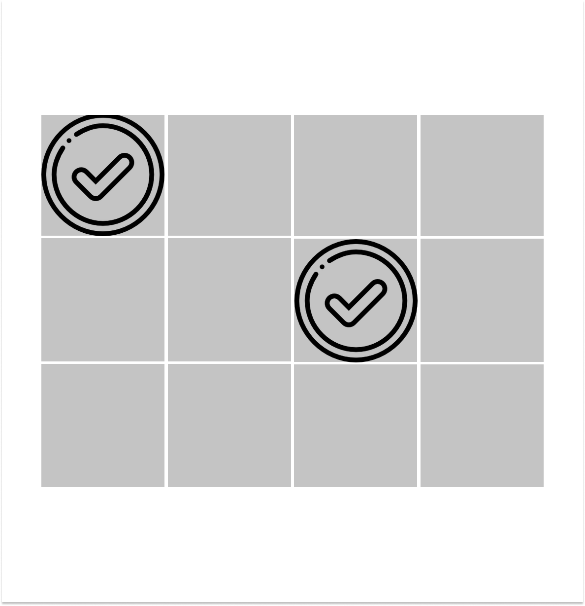

# Matching Cards Game


## Technologies and Tools used

-  HTML
- CSS
- Javascript
- git
- github
- Figma


## Wireframes

<details>

 <summary>the game board</summary>



</details>


<details>
<summary>how would it look when we click on the images</summary>    


​    

</details>


<details>

<summary>when we get a match</summary> 




</details>

## Document your planning and problem solving strategy

- i build the prototype first using [Figma](https://www.figma.com). 
- i thought of how many function i am going to create.
- how would i add the images to the Board?
- how would i tackle the issue of how to store the selected images and compare them in case if it was a match or not?
- in case if it was a match how would i stop the player from selecting the same two cards over and over again ? 


## Describe how some of your favorite functions work


```javascript
// it will take the card id for each item we click on and push the name of the item in 		    clicked and push the id in ID's then change the image source to the image original src 
function click() {
    cardId = this.getAttribute('id')
    clicked.push(cards[cardId].disc)
    IDs.push(cardId)
    this.setAttribute('src', cards[cardId].src)
    if (clicked.length == 2) {
        setTimeout(match, 1000)
    }
}

```


<details>


<summary>function match() </summary>


```javascript
function match() {
    const images = document.querySelectorAll('img')

// it will ompare with the ID's first to check if it's the same image was clicked twice or not
    if (IDs[0] == IDs[1]) {
        alert('you chosed the same image twice 🤦')
        images[IDs[0]].setAttribute('src', './img/q.png')
        images[IDs[1]].setAttribute('src', './img/q.png')
    }

//  if it wasn't the same images clicked twice then it compare with the name dicribtion 		of the image if it's the same then it's a match and remove the event listener from it 
    else if (clicked[0] == clicked[1]) {
        console.log("it's a match !🤸")
        images[IDs[0]].setAttribute('src', './img/check.png')
        images[IDs[1]].setAttribute('src', './img/check.png')
        images[IDs[0]].removeEventListener("click", click)
        images[IDs[1]].removeEventListener("click", click)

        takkenOut.push(clicked)

    }
//  if not then reset to the defult image source
    else {
        images[IDs[0]].setAttribute('src', './img/q.png')
        images[IDs[1]].setAttribute('src', './img/q.png')
    }
//  we refresh the score by adding 1 if it was a match , then reset the ID's and clicked 		 so it contain two items ONLY again.
    score.innerHTML = takkenOut.length
    IDs = []
    clicked = []
    
// if takkenout was equal to the cards/2 (Number of items) then print the congrats msg.
    if (takkenOut.length === (cards.length / 2)) {
        score.innerHTML = "Congrats 🎉"
     
    }

}

```

</details>


​																							[Live Version of the Game](https://pages.git.generalassemb.ly/ammarbahasan1/Matching-cards-game/)